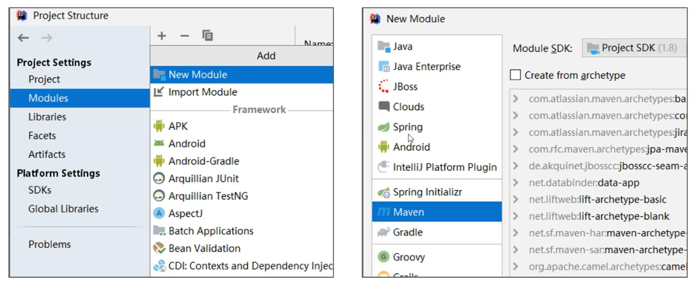

# 分模块开发与设计
#java #Maven 

---
## 分模块开发的意义
> 将原始模块按照功能拆分成若干个子模块，方便模块之间地相互调用，接口共享
## 分模块开发设计
1. 创建Maven模块

2. 书写模块代码
> 分模块开发需要针对模块功能进行设计，在进行编码。不会先将工程开发完毕，然后在进行拆分

3. 通过maven指令安装模块到本地仓库（install命令）
> 团队内部开发需要发布模块功能到团队内部可共享的仓库中（私服）