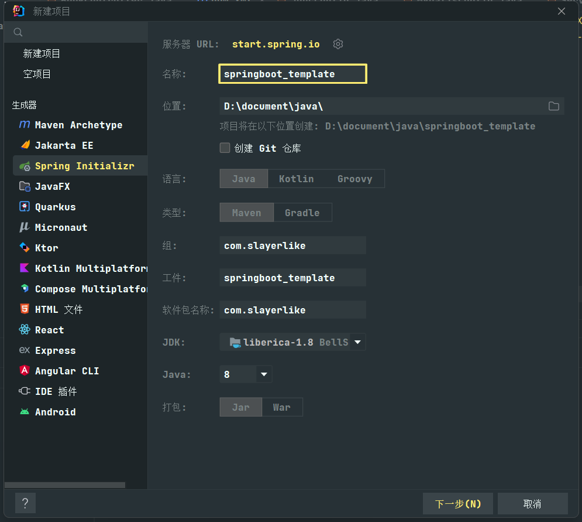

# SpringBoot
#java #SpringBoot

---
## 入门案例
1. 创建SpringBoot项目

注意将服务器url修改为：`https://start.aliyun.com/`,不然后面下载必要组件时会失败。
2. 写controller
```java
@RestController  
@RequestMapping("/books")  
public class BookController {  
    @RequestMapping("/{id}")  
    public String getById(@PathVariable Integer id){  
        System.out.println("id ==>"+id );  
        return "hello springboot";  
    }
}
```
3. 运行springboot程序
此时springboot程序已经可以运行起来了
