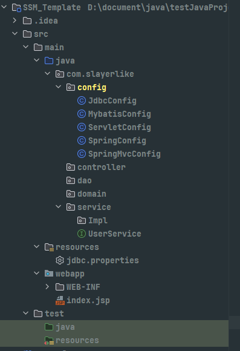

# 整合配置
#java #SSM 

---
## Maven依赖

```xml
<dependencies>  
  <dependency>  
    <groupId>junit</groupId>  
    <artifactId>junit</artifactId>  
    <version>4.13.2</version>  
    <scope>test</scope>  
  </dependency>  
  <dependency>  
    <groupId>org.springframework</groupId>  
    <artifactId>spring-webmvc</artifactId>  
    <version>5.3.22</version>  
  </dependency>  
  <dependency>  
    <groupId>org.springframework</groupId>  
    <artifactId>spring-jdbc</artifactId>  
    <version>5.3.22</version>  
  </dependency>  
  <dependency>  
    <groupId>org.springframework</groupId>  
    <artifactId>spring-test</artifactId>  
    <version>5.3.22</version>  
  </dependency>  
  <dependency>  
    <groupId>org.mybatis</groupId>  
    <artifactId>mybatis</artifactId>  
    <version>3.5.6</version>  
  </dependency>  
  <dependency>  
    <groupId>org.mybatis</groupId>  
    <artifactId>mybatis-spring</artifactId>  
    <version>2.0.7</version>  
  </dependency>  
  <dependency>  
    <groupId>mysql</groupId>  
    <artifactId>mysql-connector-java</artifactId>  
    <version>8.0.30</version>  
  </dependency>  
  <dependency>  
    <groupId>com.alibaba</groupId>  
    <artifactId>druid</artifactId>  
    <version>1.2.11</version>  
  </dependency>  
  <dependency>  
    <groupId>javax.servlet</groupId>  
    <artifactId>javax.servlet-api</artifactId>  
    <version>4.0.1</version>  
  </dependency>  
  <dependency>  
    <groupId>com.fasterxml.jackson.core</groupId>  
    <artifactId>jackson-databind</artifactId>  
    <version>2.13.4</version>  
  </dependency>  
</dependencies>
```
---
## 项目目录结构



## 配置详情
### 1. MyBatis
```java
public class MybatisConfig {  
    @Bean  
    public SqlSessionFactoryBean sqlSessionFactoryBean(DataSource dataSource){  
        SqlSessionFactoryBean sqlSessionFactoryBean = new SqlSessionFactoryBean();  
        sqlSessionFactoryBean.setDataSource(dataSource);  
        sqlSessionFactoryBean.setTypeAliasesPackage("com.slayerlike.domain");  
        return sqlSessionFactoryBean;  
    }    
    @Bean  
    public MapperScannerConfigurer mapperScannerConfigurer(){  
        MapperScannerConfigurer configurer = new MapperScannerConfigurer();  
        configurer.setBasePackage("com.slayerlike.dao");  
        return configurer;  
    }
}
```
### 2. Druid数据源
```java
public class JdbcConfig {  
    @Value("{jdbc.driver}")  
    private String driver;  
    @Value("{jdbc.url}")  
    private String url;  
    @Value("{jdbc.username}")  
    private String username;  
    @Value("{jdbc.passwd}")  
    private String passwd;  
    @Bean  
    public DataSource dataSource(){  
        DruidDataSource dataSource = new DruidDataSource();  
        dataSource.setDriverClassName(driver);  
        dataSource.setUrl(url);  
        dataSource.setUsername(username);  
        dataSource.setPassword(passwd);  
        return dataSource;  
    }
}
```
配置文件jdbc.properties
```properties
jdbc.driver=com.mysql.jdbc.Driver  
jdbc.url=jdbc:mysql://localhost:3306/ssm_db  
jdbc.username=root  
jdbc.passwd=root
```
### 3. SpringMVC
```java
@Configuration  
@ComponentScan("com.slayerlike.controller")  
@EnableWebMvc  
public class SpringMvcConfig {  
}
```
### 4. Spring
```java
@Configuration  
@ComponentScan({"com.slayerlike.service","com.slayerlike.dao"})  
@PropertySource("classpath:jdbc.properties")  //此处不加classpath:会报错
@Import({JdbcConfig.class, MybatisConfig.class})  
public class SpringConfig {  
}
```
### 5. Servlet
```java
public class ServletConfig extends AbstractAnnotationConfigDispatcherServletInitializer {  
    protected Class<?>[] getRootConfigClasses() {  
        return new Class[]{SpringConfig.class};  
    }  
    protected Class<?>[] getServletConfigClasses() {  
        return new Class[]{SpringMvcConfig.class};  
    }  
    protected String[] getServletMappings() {  
        return new String[]{"/"};  
    }
}
```