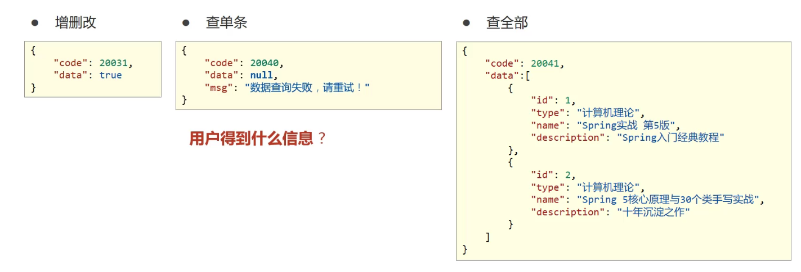

# 表现层与前端数据传输协议
#java #SSM 

---
## 表现层数据封装
- 前端接收数据格式——创建结果模型类，封装数据到data属性中
- 封装操作结果到code属性中
- 封装特殊消息到msg属性中

- 设置同意数据返回结果类
```java
@Data
public class Result{
	private Object data;
	private Integer code;
	private String msg;
}
```