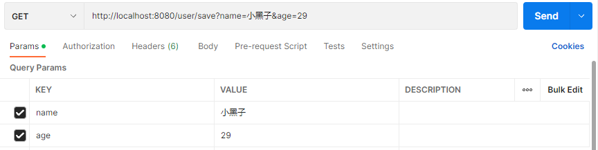
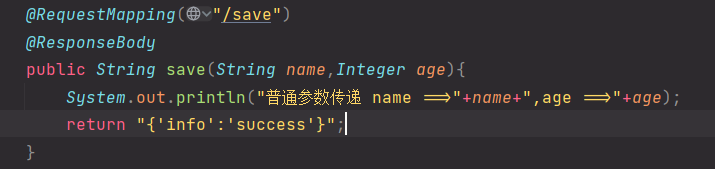
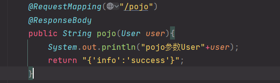
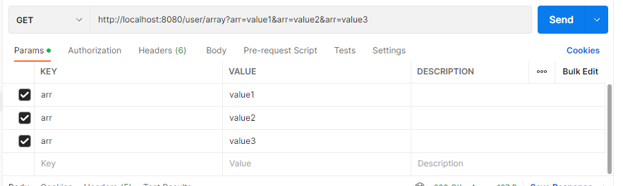
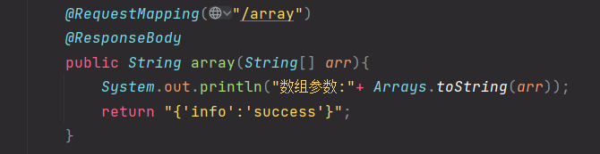
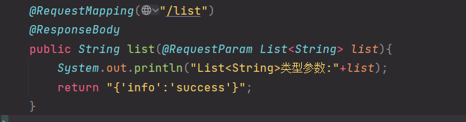

# 请求与响应
#java #SSM 

---
## 设置请求映射路径
- 在开发的时候由于多人之间可能取相同的映射路径，所以各个模块的映射应加上模块名进行区分

```java
@Controller  
@RequestMapping("/book")  
public class BookController {  
    @RequestMapping("/save")  
    void save(){  
        System.out.println("book save...");  
    }
}
//访问BookController中的save时请求路径为/book/save
```
```java
@Controller  
@RequestMapping("/user")  
public class UserController {  
    @RequestMapping("save")  
    @ResponseBody  
    public String save(){  
        System.out.println("user save ...");  
        return "{'info':'success'}";  
    }
}
//访问UserController中的save方法时请求的路径使/user/save
```
---
## 请求方式
- Get请求
- Post请求
	- Post请求参数在请求体中，post请求中文会出现乱码

在请求参数中含有中文的时候会出现乱码，这时候就需要一个过滤器进行处理，可以在配置文件类中添加一个过滤器将进行乱码的处理。
```java
public class ServletContainerSInitConfig extends AbstractAnnotationConfigDispatcherServletInitializer {  
    protected Class<?>[] getRootConfigClasses() {  
        return new Class[]{SpringConfig.class};  
    }  
    protected Class<?>[] getServletConfigClasses() {  
        return new Class[]{SpringMVCConfig.class};  
    }  
    protected String[] getServletMappings() {  
        return new String[]{"/"};  
    }    
    //处理post请求中文乱码  
    @Override  
    protected Filter[] getServletFilters() {  
        CharacterEncodingFilter filter = new CharacterEncodingFilter();  
        filter.setEncoding("UTF-8");  
        return new Filter[]{filter};  
    }
}
```
---
## 请求参数
- 参数种类
	- 普通参数
	- POJO参数 ^6f6efc
	- 嵌套POJO参数
	- 数组类型参数
	- 集合类型参数
### 普通参数
url地址传参，地址参数名与形参变量名相同，定义形参即可接收参数

 如果请求的参数名和方法参数名不同，需要加上注解使请求的参数能成功传递到方法参数中去。
 ```java
 @RequestMapping("/differentPragmaSave")  
@ResponseBody  
public String differentPragmaSave(@RequestParam("name")String  userName,@RequestParam("age") int userAge){  
    System.out.println("普通参数传递 name ==>"+userName+",age ==>"+userAge);  
    return "{'info':'success'}";  
}
```
### POJO参数
方法的参数是一个实体类

### 数组参数
postman发送数组参数的请求时需要使用相同的参数名

### 集合参数
postman发送集合数据的请求时方法和数组形式的一样，但是代码中要使用注解，防止编译器试图new出一个集合类型的对象，报没有构造方法的错误。
 ^855d22
---
## 传递json数据
- json数组
- json对象（POJO）
- json数组（POJO）
首先需要导入处理json的库的坐标 ^f741b2
```xml
<dependency>  
  <groupId>com.fasterxml.jackson.core</groupId>  
  <artifactId>jackson-databind</artifactId>  
  <version>2.13.4</version>  
</dependency>
```

^967b0f

在SpringMVC的配置类中添加注解`@EnableWebMvc`开启json转换为对象的功能，当然这个注解的功能不止这一个
postman发送json数据
![[postman发送json数据.png]] ^e66eae
### json数组
java代码中需要在形参前加上注解`@RequestBoy`使其知道请求的数据是响应体中，防止报错 ^889f2b

这与上文中这一点类似:
### json对象（POJO）
只需要在
的基础之上，在形参前加上注解`@RequestBody`，就可以接收json数据并将json数据转换为相应的实体类对象了。
### 传递json数据总结
1. 导包![[#^967b0f]]
2. 开启自动转换json数据的支持
3. 设置接收json数据
---
### `@RequestBody`与`@RequestParma`的区别
- 区别
	- `@RequestBody`用于接收json数据[application/json]
	- `@RequestParam`用于接收url地址传参，表单传参[application/x-www-form-urlencoded]
- 应用
	- 后期开发中，发送json格式数据为主`@RequestBody`应用较广
	- 如果发送非json格式数据，选用`RequestParma`接收请求参数
---
## 日期类型参数传递
 - 日期类型数据基于系统不同格式也不尽相同
	 - 2001-01-07
	 - 2001/01/07（默认的类型，不需要使用注解指定模式）
	 - 07/01/2001
日期格式可以直接作为参数传递，但是非默认的模式需要使用注解`@DateTimeFormat(pattern = "模式")`来进行匹配
```java
@RequestMapping("/date")  
@ResponseBody  
public String data(Date date1, @DateTimeFormat(pattern = "yyyy-MM-dd")Date date2,@DateTimeFormat(pattern = "dd/MM/yyyy") Date date3){  
    System.out.println("data1默认格式(yyyy/MM/dd:"+date1 );  
    System.out.println("data2(yyyy-MM-dd):"+date2 );  
    System.out.println("data3(dd/MM/yyyy):"+date3);  
    return "{'info':'success'}";  
}
```
### 类型转换器
- Convert接口

 ```java
	public interface Convert<S,T>{
		@Nullable
		T convert(S var1);
	}
```
- 
	- 请求参数年龄数据(String -->Integer)
	- 日期格式转换(String -->Date)

`@EnableWebMvc`的功能之一：根据类型匹配对应的类型转换器