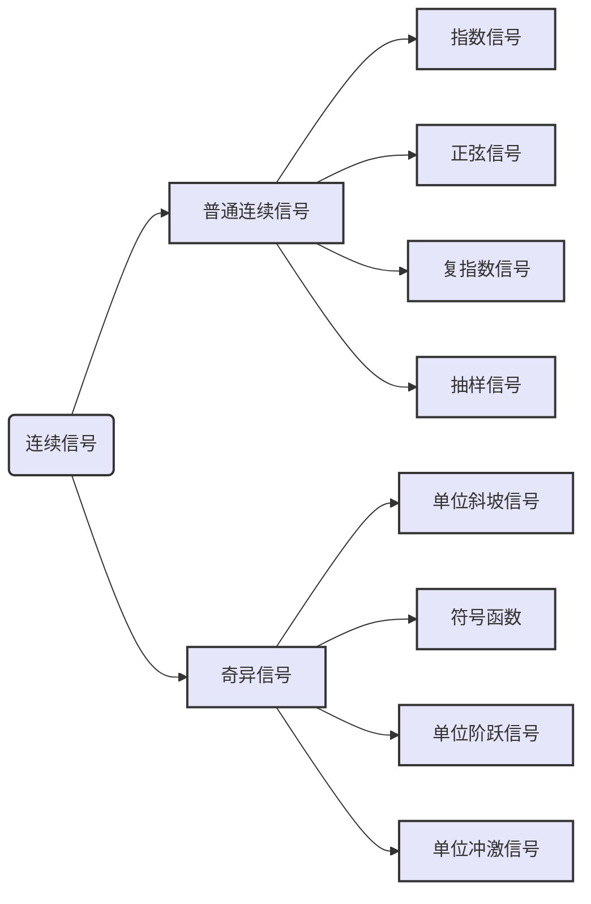

# 1.普通连续信号与奇异信号
`普通连续信号`是指函数的`定义域`和`值域`没有不连续的点（及跳变点）的信号。
`奇异连续信号`是指`函数本身`或其`导数`与`积分`有不连续的点（及跳变点）的信号。

## 1.1普通连续信号
### 1.1.1指数信号
指数信号可以表示为$f(t) = Ke^{\alpha t}$

### 1.1.2正弦信号
利用正弦函数与余弦函数表示的信号统称为正弦信号，可以表示为$f(t) = Acos(\omega t - \theta)$

其中，周期T，频率f，角频率$\omega$的关系：$T = {{2 \pi}\over {\omega}} = {1 \over f}$
正弦信号求导、积分后仍为正弦信号。
指数信号可以转化为正弦信号：
 $e^{j\omega t} = cos\omega t + jsin\omega t$
  $e^{-j\omega t} = cos\omega t - jsin\omega t$
正弦信号转化为指数信号：
$sin\omega t ={ 1 \over {2j}} (e^{j\omega t} - e^{-j\omega t})$
$cos\omega t = {1 \over 2}(e^{j\omega t} + e^{-j\omega t})$
### 1.1.3复指数信号
复指数信号可表示为$f(t) = {Ke^{st}} = {Ke^{(\sigma + j\omega)t }} = {Ke^{\sigma t}(cos\omega t + jsin\omega t)}$其中$s = \sigma + j\omega$
复指数信号中，$\sigma$决定增长衰减，$\omega$决定震荡快慢；

|$\sigma$的大小|$\omega$的大小|最终结果|
|:------:|:------:|:-----:|
|$\sigma = 0$ |$\omega \neq 0$ |实部虚部为等幅振荡|
|$\sigma > 0$ |$\omega \neq 0$ |实部虚部为增长震荡|
|$\sigma < 0$ |$\omega \neq 0$ |实部虚部为衰减震荡|
|$\sigma \neq 0$ |$\omega = 0$ |实部虚部为指数信号|
|$\sigma = 0$ |$\omega = 0$ |$f(t) = K$为直流信号|
### 1.1.4抽样信号
抽样信号表示为：$f(t) = {sint \over t} = Sa(t)$

Sa(t)为t的偶函数，过零点$t = n\pi \quad n = \pm 1,\pm 2,...$
$\displaystyle \lim_{t \to 0}Sa(t)=\displaystyle \lim_{t \to 0}{sint \over t} = 1 \qquad \displaystyle \lim_{t \to \infty}Sa(t) = 0$
了解两个定积分:
$\displaystyle \int_{0}^{\infty}Sa(t)dt = {\pi \over 2} \qquad \displaystyle \int_{-\infty}^{+\infty}Sa(t)dt = \pi$
## 1.2奇异信号
### 1.2.1单位斜坡信号
单位斜坡信号的表示：$\begin{equation} r(t)= \begin{cases} 0& \text{t<0}\\ t& {t \ge 0} \end{cases} \end{equation}$

