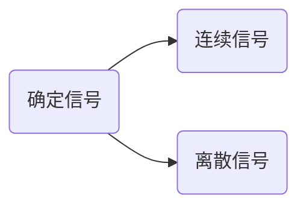

# 1.确定信号与随机信号
* `确定信号`：可用确定的时间函数表示的信号
* `随机信号`：信号不能用确切的函数表示，只可能知道他的统计特性比如概率，例如：电子系统中的起伏热噪声、雷电干扰信号。

`连续时间按信号`：连续时间范围内（$-\infty < t < \infty$)有定义的信号，简称`连续信号`，若其函数值也连续，常称为模拟信号。
![[Pasted image 20220829145425.png]]
`离散时间信号`：仅在一些离散的瞬间才有定义的信号，简称`离散信号`，当取值为规定的数值时，常称为数字信号。
![[Pasted image 20220829145729.png]]
上图f(t)仅在一些离散的时刻$t_{k} \quad  （k=0,\pm 1,\pm 2,...）$有定义，其余时间`无定义`。
相邻离散点的时间间隔$T_{k} = t_{k + 1}-t_{k}$通常取等间隔T,离散信号可表示为f(kT),简写为`f(k)`,这种等间隔的离散信号也成为序列。其中`k`称为`序号`。
![[Pasted image 20220829150439.png]]
或写为:
$f(k) = \{...,0,1,2,-1.5,2,0,1,0,...\}$
# 2.周期信号与非周期信号
`周期信号`是定义在$(-\infty,\infty)$区间，每隔一定时间T(或整数N)，按相同规律重复变化，的信号。
不具有周期性的信号称为`非周期信号`。
## 2.1连续信号的周期
* 定义：连续周期信号f(t),周期为T，满足：
$f(t) = f(t + mT),\quad m = 0,\pm 1,\pm 2,...$
* 典型周期连续信号：余弦信号$cos\omega t$,周期${T}= {{2\pi} \over {\omega}}  (s)$
* 两个周期信号的`合成`：若$f_{1}(t)$的周期为$T_1$,$f_2 (t)$的周期为$T_2$,求$f_1(t)+f_2(t)$的周期时，若$T_1 / T_2$为有理数，则$f_1(t) + f_2(t)$仍未周期信号，周期为$T_1$和$T_2$的最小公倍数。
## 2.2离散信号的周期
* 定义：离散周期信号f(k)，周期为N，满足下式：
$f(k) = f(k + mN)，\quad m =0, \pm 1,\pm 2,...$

`例`：判断正弦序列$f(k) = sin(\beta k)$是否为周期信号，若是，确定周期，式中$\beta$为数字角频率，单位：rad。
$$
\begin{align}
f(k)
&=sin(\beta k) = sin(\beta k + 2m\pi),m = 0,\pm 1,\pm 2,...\\
&=sin[\beta (k + m{{2\pi}\over{\beta}})] = sin[\beta (k + mN)]\\
&N = {2\pi \over \beta}
\end{align}
$$
`结论`： 
* 当$2\pi / \beta$为整数时，正弦序列具有周期$N = 2\pi /\beta$；
* 当$2\pi / \beta$为有理数时，正弦序列仍具有周期性，但其周期为$N = M{(2\pi /\beta)}$,M取使N为最整数的最小整数；
* 当$2\pi /\beta$为无理数时，正弦序列为非周期序列。

 ![[Pasted image 20220829164745.png]]

`结论`：
* 连续正弦信号一定是周期信号，而正弦序列不一定时周期序列。
* 两个连续周期信号的和不一定是周期信号，而两个周期序列的和一定是周期序列。

# 3.能量和功率信号，因果和反因果信号
## 3.1 能量信号和功率信号
将信号f(t)施加到1$\Omega$的电阻上，他所消耗的功率为${\lvert f(t)\rvert}^2$,在区间$(-\infty,\infty)$的`能量`和`平均功率`定义为：
$E = \displaystyle \int_{-\infty}^{\infty}{\lvert f(t)\rvert}^2 dt$
$P = \displaystyle \lim_{T \to \infty} {1 \over T}{\displaystyle \int_{-{T\over 2}}^{T\over 2}{\lvert f(t) \rvert}^2 dt}$
能量有限信号：信号的能量$E < \infty$,简称为`能量信号`，此时P=0；
功率有限信号：信号的功率$P < \infty$,简称为`功率信号`，此时E=0.

对于离散信号，也有能量信号、功率信号之分。
`能量信号`：满足$E = \displaystyle \sum_{k = -\infty}^{\infty} {\lvert f(k)\rvert}^2 < \infty$的离散信号。
`功率信号`：满足$P = \displaystyle \lim_{N \to \infty} {1\over N}\displaystyle \sum_{k = -{N\over 2}}^{N \over 2}{\lvert f(k) \rvert}^2 < \infty$的离散信号。

`结论`：
* 时限信号（仅在有限时间区间不为0）为能量信号；
* 周期信号输入功率信号；
* 非周期信号可能是能量信号也可能是功率信号；
* 有些信号既不是能量信号也不是周期信号，如$f(t) = e^t$。

## 3.2因果信号和反因果信号
* `因果信号`：t < 0, f(t) = 0的信号f(t)，【即t = 0时接入系统的信号】，比如阶跃信号。
* `反因果信号`：$t \ge 0$，f(t) = 0的信号（除0信号以外)。

