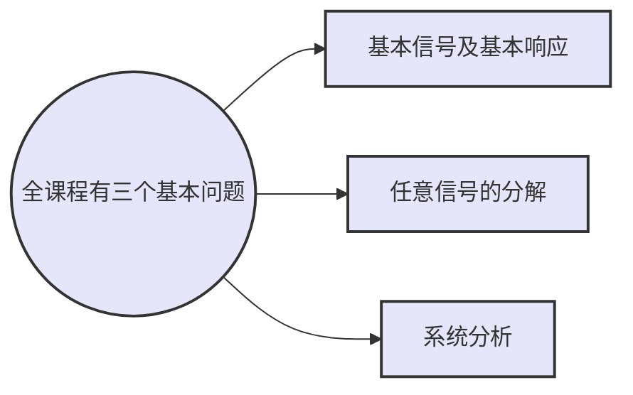

# 1.阶跃信号
- 定义：选定一个函数序列$\gamma _n(t)$，求极限
![[Pasted image 20220830145353.png]]
$$
\begin{equation}
\varepsilon (t) = \displaystyle \lim_{n \to \infty} {\gamma _n(t)} = \left\{
\begin{aligned}
& 0,\quad t<0 \\
&1,\quad t>0
\end{aligned}
\right.
\end{equation}
$$
- 性质：
	- 表示分段常量信号
	![[Pasted image 20220830150616.png]]
	$f(t) = 2\varepsilon (t) - 3\varepsilon (t - 1) + \varepsilon (t- 2)$
	- 表示信号的作用区间
	![[Pasted image 20220830150746.png]]
	- 积分 $\displaystyle \int_{-\infty}^t \varepsilon (\tau)d\tau = t\varepsilon (t)$
# 2.冲激函数
## 2.1定义：
`单位冲激函数`：是奇异函数，它是对强度极大，作用时间极短的物理量的理想化模型（狄拉克提出）
$$
\left\{
\begin{aligned}
&\delta (t) = 0,\qquad t\ne 0\\
&\int_{-\infty}^{\infty}\delta (t)dt = 1
\end{aligned}
\right .
$$
`理解`：高度无穷大，宽度无穷小，面积为1的对称窄脉冲。
![[Pasted image 20220830152050.png]]
## 2.2冲激函数和阶跃函数的关系
![[Pasted image 20220830152431.png]]
$\delta (t) = {d\varepsilon (t) \over dt}$
$\varepsilon (t) = \displaystyle \int_{-\infty}^t\delta (t)dt$
## 2.3作用
冲激函数可以描述间断点的导数。
![[Pasted image 20220830154850.png]]
$f(t) = 2\varepsilon (t+1) - 2\varepsilon (t-1)\qquad f(t) = 2\delta(t+1)-2\delta (t-1)$
## 2.4冲激函数的广义函数定义
### 2.4.1广义函数定义
`广义函数`$N_g[\varphi (t)]$:选择一类性能良好的函数$\varphi (t)$作为`检验函数`（相当于自变量），一个广义函数$g(t)$对检验函数空间中的每个函数$\varphi (t)$赋予一个数值N的`映射`，记为：
$N_g[\varphi (t)] = \displaystyle \int_{-\infty}^{\infty}g(t)\varphi (t)dt$

广义函数与普通函数的对应关系：

|类型|定义式|自变量|定义域|函数值|
|:--:|:--:|:--:|:--:|:--:|
|普通函数|$y = f(t)$|t|$(t_1,t_2)$|$f(t)$|
|广义函数|$N_g[\varphi (t)] = \displaystyle \int_{-\infty}^{\infty}g(t)\varphi (t)dt$|$\varphi (t)$|$\{\varphi (t)\}$|$N_g[\varphi (t)]$|
### 2.4.2冲激函数的广义函数定义
$\displaystyle \int_{-\infty}^{\infty}\delta (t)\varphi (t)dt = \varphi (0)$
`含义`：冲激函数$\delta (t)$作用与检验函数$\varphi (t)$的结果赋值为$\varphi (0)$，称为冲激函数的取样性质。
简言之，能从检验函数$\varphi (t)$中筛选出函数值$\delta (0)$的广义函数就称为冲激函数$\delta (t)$。举例如下：
高斯（钟形）函数：$\delta (t) = \displaystyle \lim_{b \to \infty}be^{-\pi {(bt)}^2}$
![[Pasted image 20220830161357.png]]
取样函数：$\delta (t) = \displaystyle \lim_{b \to \infty} {sin(bt) \over \pi t}$
![[Pasted image 20220830161405.png]]
### 2.4.3冲激函数的取样性质
1. $f(t)$乘以$\delta (t)$
$f(t)\delta (t) = f(0)\delta (t)$
$\displaystyle \int_{-\infty}^{\infty}f(t)\delta (t) = f(0)\displaystyle \int_{-\infty}^{\infty}\delta (t)dt = f(0)$
注意：积分区间要包含冲激所 在的时刻t = 0。
`例`:
![[Pasted image 20220830162153.png]]![[Pasted image 20220830162543.png]]
